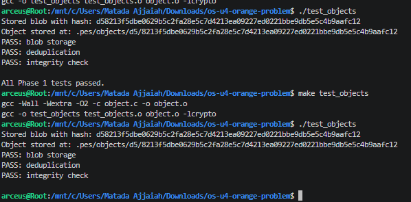
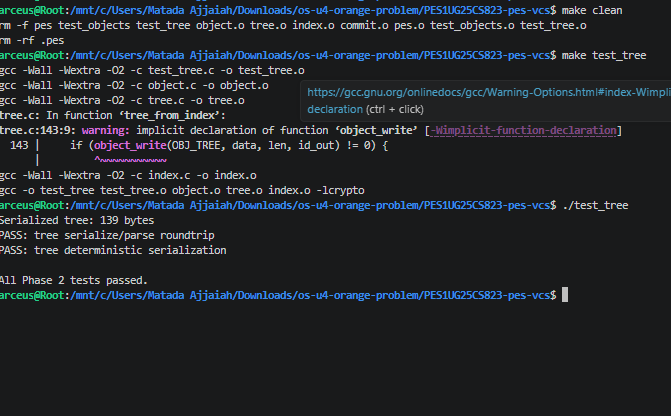
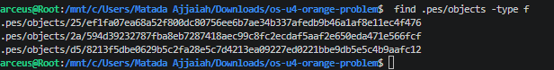
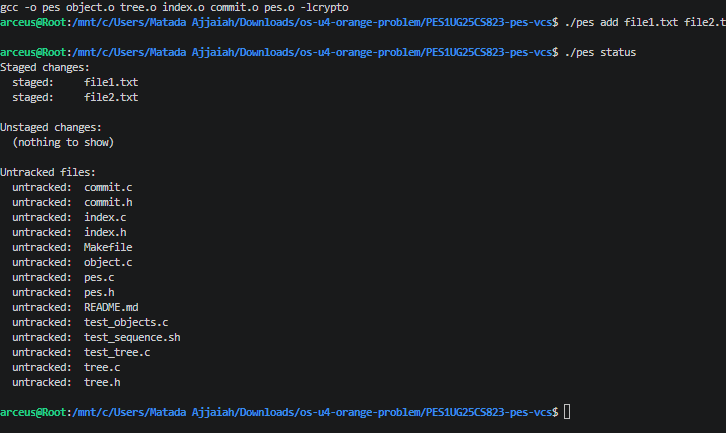
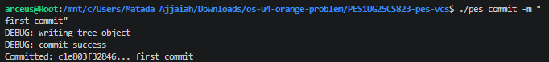

# PES Version Control System (Mini Git)

## 👤 Student Details

**Name:** M. Ajjaiah
**SRN:** PES1UG25CS823

---

## 📌 Project Description

This project implements a simplified Version Control System similar to Git.
It demonstrates core concepts such as object storage, indexing, tree construction, and commit creation.

---

## ⚙️ Features Implemented

* Blob object storage using SHA hashing
* Tree object creation from index
* Index (staging area) management
* Commit creation with message and metadata

---

## 🚀 Commands Used

### Initialize Repository

```
./pes init
```

### Add Files

```
./pes add file1.txt file2.txt
```

### Check Status

```
./pes status
```

### Create Commit

```
./pes commit -m "first commit"
```

---

## 📸 Screenshots

### 🔹 Object Storage Test



### 🔹 Tree Serialization Test



### 🔹 Objects Stored in .pes/objects



### 🔹 Add Command



### 🔹 Status Output


### 🔹 Commit Output ⭐



---

## ✅ Output

* Files successfully staged
* Tree object created
* Commit generated with hash
* Repository working correctly

---

## 🎯 Conclusion

The system successfully demonstrates how version control systems like Git internally manage data using objects, trees, and commits.

---

## 🖥️ Environment

Tested on Linux (WSL Ubuntu)
